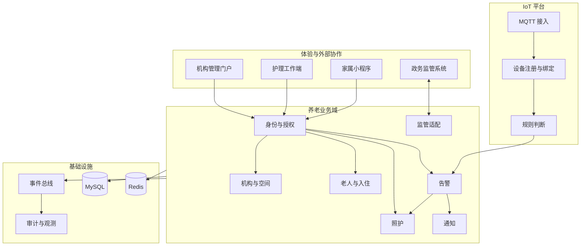

# SmartCareOS 企业级架构总览

## 来源事实

《招聘信息汇总.md》确认了以下业务与技术边界。

- 公司面向养老机构、社区及政府部门提供智慧养老和居家适老化方案，见第 11 行。
- 产品包含机构端 PC 后台、家属微信小程序和政务监管接口，见第 15 至 17 行。
- 智能手环、床垫、紧急按钮等设备通过 MQTT 采集数据并触发报警，见第 18 行。
- 技术岗位覆盖 Spring Boot、Spring Cloud、MySQL、Redis、REST API 和消息队列，见第 28 至 41 行、第 61 至 66 行。
- 智能护理床属于产品线，研发过程覆盖概念、试产、量产、认证及供应链协作，见第 79 至 95 行。
- 客户包括医疗机构、养老机构和经销商，并涉及订单、物流和售后跟进，见第 108 至 113 行及产品销售截图。

## 架构推演

下面的领域边界、服务关系、事件模型和部署方式属于工程设计，需要通过真实业务访谈、设备协议 POC 和合规评审验证。

## 核心业务流

1. 机构维护院区、房间、床位和护理人员。
2. 老人入住并建立床位、联系人和授权关系。
3. 设备注册、激活并在有效时间段绑定老人或床位。
4. MQTT 接入器校验设备身份、Topic、消息模式和事件幂等键。
5. 规则判断产生风险事件，告警域创建唯一告警。
6. 护理员确认、开始处理并记录结果，超时事项按级别升级。
7. 授权家属收到最小必要摘要，监管数据通过独立适配器交换。
8. 所有敏感读取、状态变化、导出和外部提交都进入审计。

## 工程演进

当前采用模块化单体，让领域规则在一个部署单元内快速稳定。上下文通过端口和领域事件隔离，不共享内部模型。出现独立扩缩容、独立发布或团队自治需求后，再按上下文拆分服务。

| 阶段 | 工程目标 | 退出条件 |
|---|---|---|
| 0 | 告警纵向切片 | 状态规则、幂等和 API 测试通过 |
| 1 | 机构、老人、设备、照护模块 | 核心业务旅程可自动化复现 |
| 2 | MQTT、MySQL、outbox、鉴权 | 重放、断网、越权和恢复测试通过 |
| 3 | 机构门户、护理端、家属端 | 角色与租户隔离验收通过 |
| 4 | 监管适配与生产运行 | 压测、备份恢复和应急演练通过 |

当前进度：阶段 0、1 的后端纵向切片已完成；阶段 2 已交付 MySQL 兼容持久化、Flyway、Outbox/Inbox、MQTT Broker 无关接入核心及可选 API Key 鉴权；阶段 4 已交付通知投递记录和政务交换任务/回执骨架。阶段 3 的门户、护理端和家属端，以及真实 Broker、队列和第三方通道仍需结合部署环境实施。
