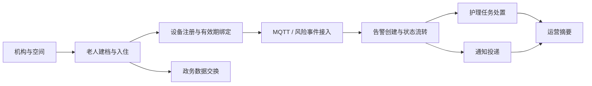

# SmartCareOS 系统模块接口目录

## 文档入口

- Knife4j：`http://localhost:8080/doc.html`
- OpenAPI JSON：`http://localhost:8080/v3/api-docs`
- Swagger UI：`http://localhost:8080/swagger-ui.html`
- 接口版本：`v1`，统一前缀 `/api/v1`

本地和集成环境默认启用文档。`production` profile 默认关闭；只有显式设置
`SMARTCAREOS_API_DOCS_ENABLED=true` 时才开放。该设置只控制文档，不改变业务 API。

## 认证、租户与角色

除 `GET /api/v1/system/health` 外，启用安全基线后所有接口都需要以下两种认证方式之一：

1. API Key：同时提供 `X-SmartCare-Tenant`、`X-SmartCare-Principal`、
   `X-SmartCare-Api-Key`。
2. OIDC：提供 `Authorization: Bearer <JWT>`；Token 需要包含 `sub`、`tenant_id`
   和非空 `roles`。

| 角色 | 当前权限基线 |
|---|---|
| `ADMIN` | 全部业务接口；唯一可签发和撤销 API 凭据的角色 |
| `OPERATOR` | 日常运营接口，不含 API 凭据管理和政务交换 |
| `CAREGIVER` | 所有查询；告警确认/开始/解决及护理任务开始/完成 |
| `AUDITOR` | 只读查询 |
| `DEVICE_INGEST` | 仅可提交 `POST /device-risk-events` |

资源 ID、请求体 `tenantId` 与认证租户不一致时返回 `403`。业务写操作及被拒绝请求会进入
追加式审计。`404` 表示资源不存在，`409` 表示状态或唯一性冲突，`422` 表示业务规则不满足。

## 接口总览

当前共 **9 个文档模块、10 个控制器、46 个 HTTP 接口**。Knife4j 同时提供
`00-全部接口` 和以下领域分组。

| 分组 | 限界上下文/职责 | 接口数 | 当前状态 |
|---|---|---:|---|
| 01 身份与授权 | Identity：API 凭据生命周期 | 2 | 已实现 |
| 02 机构与空间 | Institution：机构、房间、床位 | 4 | 已实现 |
| 03 老人与入住 | Elder：老人主档、入住、离院 | 5 | 已实现 |
| 04 设备与 IoT | Device：产品、设备、绑定、风险事件 | 8 | 已实现 |
| 05 告警中心 | Alarm：告警状态机与升级 | 7 | 已实现 |
| 06 照护管理 | Care：计划、任务、处置闭环 | 8 | 已实现 |
| 07 通知中心 | Notification：投递任务与结果 | 5 | 沙箱链路已实现 |
| 08 政务交换 | Government：交换任务与回执 | 5 | 沙箱链路已实现 |
| 09 运营与系统 | Dashboard/System：汇总与健康 | 2 | 已实现 |

## 01 身份与授权

| 方法 | 路径 | 用途 | 主要输入 | 成功响应 |
|---|---|---|---|---|
| POST | `/api/v1/api-credentials` | 签发 API Key | `tenantId, principalId, expiresAt?, role` | `201 IssuedCredential`；密钥只返回一次 |
| DELETE | `/api/v1/api-credentials/{credentialId}` | 撤销有效凭据 | 路径 ID | `204` |

## 02 机构与空间

| 方法 | 路径 | 用途 | 主要输入 | 成功响应 |
|---|---|---|---|---|
| POST | `/api/v1/institutions` | 创建机构 | `tenantId, institutionCode, name` | `201 InstitutionSnapshot` |
| POST | `/api/v1/institutions/{institutionId}/rooms` | 创建房间 | `roomCode, name` | `201 RoomSnapshot` |
| POST | `/api/v1/rooms/{roomId}/beds` | 创建床位 | `bedCode` | `201 BedSnapshot` |
| GET | `/api/v1/beds/{bedId}` | 查询床位 | 路径 ID | `200 BedSnapshot` |

## 03 老人与入住

| 方法 | 路径 | 用途 | 主要输入 | 成功响应 |
|---|---|---|---|---|
| POST | `/api/v1/elders` | 创建老人档案 | `tenantId, elderNo, name` | `201 ElderSnapshot` |
| GET | `/api/v1/elders/{elderId}` | 查询老人档案 | 路径 ID | `200 ElderSnapshot` |
| POST | `/api/v1/admissions` | 办理入住 | `tenantId, elderId, bedId, admittedAt, actorId` | `201 AdmissionSnapshot` |
| GET | `/api/v1/admissions/{admissionId}` | 查询入住记录 | 路径 ID | `200 AdmissionSnapshot` |
| POST | `/api/v1/admissions/{admissionId}/discharge` | 办理离院 | `dischargedAt, actorId` | `200 AdmissionSnapshot` |

## 04 设备与 IoT

| 方法 | 路径 | 用途 | 主要输入 | 成功响应 |
|---|---|---|---|---|
| POST | `/api/v1/device-products` | 创建设备产品 | `tenantId, productKey, name` | `201 DeviceProductSnapshot` |
| POST | `/api/v1/devices` | 注册设备 | `tenantId, deviceKey, productId, actorId` | `201 DeviceSnapshot` |
| GET | `/api/v1/devices/{deviceId}` | 查询设备 | 路径 ID | `200 DeviceSnapshot` |
| POST | `/api/v1/devices/{deviceId}/activate` | 激活设备 | `actorId` | `200 DeviceSnapshot` |
| POST | `/api/v1/devices/{deviceId}/disable` | 停用设备 | `actorId` | `200 DeviceSnapshot` |
| POST | `/api/v1/devices/{deviceId}/bindings` | 绑定老人 | `elderId, validFrom, validTo?, createdBy` | `201 DeviceBinding` |
| DELETE | `/api/v1/devices/{deviceId}/bindings/{bindingId}` | 结束绑定 | 查询参数 `validTo` | `200 DeviceBinding` |
| POST | `/api/v1/device-risk-events` | 接收标准风险事件 | `eventId, tenantId, deviceId, elderId, severity, observedAt` | `202` 新处理；`200` 重复事件 |

风险事件接口是 MQTT 接入器归一化后的内部边界，并非设备厂商原始 Topic/载荷契约。

## 05 告警中心

| 方法 | 路径 | 用途 | 主要输入 | 成功响应 |
|---|---|---|---|---|
| POST | `/api/v1/alarms` | 幂等创建告警 | `tenantId, elderId, sourceEventId, severity` | `201` 新建；`200` 已存在 |
| GET | `/api/v1/alarms/{alarmId}` | 查询告警 | 路径 ID | `200 AlarmSnapshot` |
| POST | `/api/v1/alarms/{alarmId}/acknowledge` | 确认告警 | `actorId` | `200 AlarmSnapshot` |
| POST | `/api/v1/alarms/{alarmId}/start` | 开始处置 | `actorId` | `200 AlarmSnapshot` |
| POST | `/api/v1/alarms/{alarmId}/resolve` | 解决告警 | `actorId` | `200 AlarmSnapshot` |
| POST | `/api/v1/alarms/{alarmId}/close` | 关闭告警 | `actorId` | `200 AlarmSnapshot` |
| POST | `/api/v1/alarms/{alarmId}/escalate` | 升级告警 | `actorId` | `200 AlarmSnapshot` |

## 06 照护管理

| 方法 | 路径 | 用途 | 主要输入 | 成功响应 |
|---|---|---|---|---|
| POST | `/api/v1/care-plans` | 创建照护计划 | `tenantId, elderId, name, scheduleRule` | `201 CarePlanSnapshot` |
| POST | `/api/v1/care-plans/{planId}/activate` | 启用照护计划 | 路径 ID | `200 CarePlanSnapshot` |
| POST | `/api/v1/care-plans/{planId}/tasks` | 从计划创建任务 | `title, assigneeId, dueAt, actorId` | `201 CareTaskSnapshot` |
| POST | `/api/v1/alarms/{alarmId}/care-task` | 从告警幂等派单 | 同上 | `201` 新建；`200` 已存在 |
| GET | `/api/v1/care-tasks/{taskId}` | 查询护理任务 | 路径 ID | `200 CareTaskSnapshot` |
| POST | `/api/v1/care-tasks/{taskId}/start` | 开始任务 | `actorId` | `200 CareTaskSnapshot` |
| POST | `/api/v1/care-tasks/{taskId}/complete` | 完成任务 | `actorId, resultSummary` | `200 CareTaskSnapshot` |
| POST | `/api/v1/care-tasks/{taskId}/cancel` | 取消任务 | `actorId` | `200 CareTaskSnapshot` |

## 07 通知中心

| 方法 | 路径 | 用途 | 主要输入 | 成功响应 |
|---|---|---|---|---|
| POST | `/api/v1/notification-deliveries` | 创建投递任务 | `tenantId, businessType, businessId, channel, recipient, summary` | `200` 任务快照 |
| GET | `/api/v1/notification-deliveries/{id}` | 查询投递任务 | 路径 ID | `200` 任务快照 |
| POST | `/api/v1/notification-deliveries/{id}/dispatch` | 调用通道派发 | 路径 ID | `200` 更新后快照 |
| POST | `/api/v1/notification-deliveries/{id}/sent` | 标记发送成功 | 路径 ID | `200` 更新后快照 |
| POST | `/api/v1/notification-deliveries/{id}/failed` | 标记发送失败 | `error` | `200` 更新后快照 |

## 08 政务交换

| 方法 | 路径 | 用途 | 主要输入 | 成功响应 |
|---|---|---|---|---|
| POST | `/api/v1/government-exchanges` | 创建交换任务 | `tenantId, contractCode, mappingVersion, periodStart, periodEnd, payload` | `200` 任务快照 |
| GET | `/api/v1/government-exchanges/{id}` | 查询交换任务 | 路径 ID | `200` 任务快照 |
| POST | `/api/v1/government-exchanges/{id}/submit` | 提交交换任务 | 路径 ID | `200` 更新后快照 |
| POST | `/api/v1/government-exchanges/{id}/dispatch` | 派发监管数据 | 路径 ID | `200` 更新后快照 |
| POST | `/api/v1/government-exchanges/{id}/receipt` | 登记监管回执 | `accepted, externalReceipt, message?` | `200` 更新后快照 |

通知和政务接口当前连接本地沙箱适配器。真实微信、短信和监管端点仍依赖第三方凭据及正式契约。

## 09 运营与系统

| 方法 | 路径 | 用途 | 主要输入 | 成功响应 |
|---|---|---|---|---|
| GET | `/api/v1/dashboard/summary` | 查询租户运营摘要 | 认证租户或 `X-SmartCare-Tenant` | `200` 六类业务指标 |
| GET | `/api/v1/system/health` | 查询应用、数据库和模式版本 | 无 | `200 status/database/schemaVersion/time` |

## 核心接口调用顺序

## 来源事实与架构推演

- 来源事实：智慧养老、机构管理、家属小程序、政务接口、MQTT 设备、MySQL 和消息队列来自
  《招聘信息汇总.md》。
- 架构推演：REST 资源路径、请求字段、状态机、限界上下文、API Key/OIDC、角色矩阵、
  租户边界、Knife4j 分组及通知/政务适配器均为当前工程契约，需要随真实业务和外部协议持续版本化。
