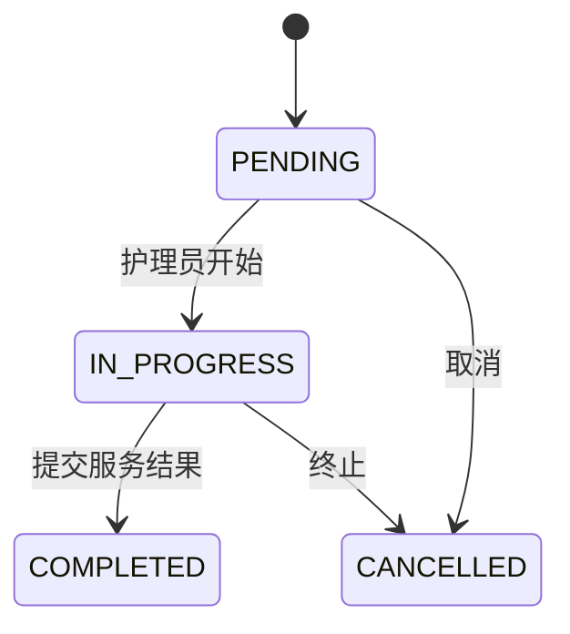

# 护理工作流

## 来源事实

《招聘信息汇总.md》支撑智慧养老、机构管理和设备告警的业务边界，但未定义护理任务状态机。

## 架构推演

```mermaid
stateDiagram-v2
  [*] --> PENDING
  PENDING --> IN_PROGRESS: 护理员开始
  IN_PROGRESS --> COMPLETED: 提交服务结果
  PENDING --> CANCELLED: 取消
  IN_PROGRESS --> CANCELLED: 终止
```

计划是可复用日程，任务是一次执行。告警可幂等创建一个护理任务。任务轨迹、护理记录和 Outbox 事件在同一事务提交。
