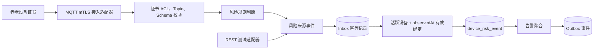

# 设备风险事件接入

## 来源事实

《招聘信息汇总.md》明确提及智能手环、床垫、紧急按钮等设备通过 MQTT 采集数据和触发报警，也列出了 JetLinks、RocketMQ 及多种消息队列能力。材料没有给出设备 Topic、载荷 Schema、设备认证方式、绑定查询规则或确定的消息中间件选型。

## 架构推演

当前工程把原始“设备事件”和可触发业务响应的“风险来源事件”分开。接入层未来负责设备认证、Topic 与 Schema 校验、绑定解析和规则判断；告警域只接收已经归一化的风险来源事件。

一次首次处理在同一事务中完成：

1. 按消费者、租户和事件 ID 写入 Inbox；
2. 确认同租户设备处于 `ACTIVE`，并在事件 `observedAt` 时刻绑定请求中的老人；
3. 保存不可变的风险来源事件；
4. 创建唯一告警与初始状态轨迹；
5. 写入 `AlarmCreated.v1` Outbox 事件；
6. 标记 Inbox 已处理并提交事务。

任何步骤失败都会整体回滚。相同事件再次到达时返回原告警；相同事件 ID 但载荷指纹不同则拒绝处理，避免设备或生产者错误被错误地当成正常重复消息。

## 当前业务表

| 表 | 职责 | 关键约束 |
|---|---|---|
| `device_risk_event` | 保存归一化风险事实 | `(tenant_id, event_id)` 唯一 |
| `device_product` | 设备型号与产品身份 | `(tenant_id, product_key)` 唯一 |
| `device` | 设备实例与当前状态 | `(tenant_id, device_key)` 唯一，版本乐观锁 |
| `device_status_history` | 设备状态追加轨迹 | `(device_id, sequence_no)` 唯一 |
| `device_binding` | 设备服务对象的有效期关系 | 设备行锁 + 重叠检查 |
| `inbox_message` | 保存消费者幂等凭据 | `(consumer_name, tenant_id, event_id)` 唯一 |
| `alarm` | 保存需人工处置的业务事项 | `(tenant_id, source_event_id)` 唯一 |
| `alarm_transition` | 保存告警状态轨迹 | `(alarm_id, sequence_no)` 唯一 |
| `outbox_event` | 保存待发布领域事件 | `event_id` 唯一 |

## 待验证契约

- 批量设备证书签发/撤销、保留消息和遗嘱策略；
- 设备证书或密钥的签发、轮换、吊销和租户隔离；
- 床位与空间绑定的业务开放条件（老人绑定及发生时间校验已实施）；
- 原始载荷 Schema、单位、时间同步和乱序窗口；
- JetLinks 是否作为设备平台，以及 RocketMQ/RabbitMQ/Kafka 的最终选型。
