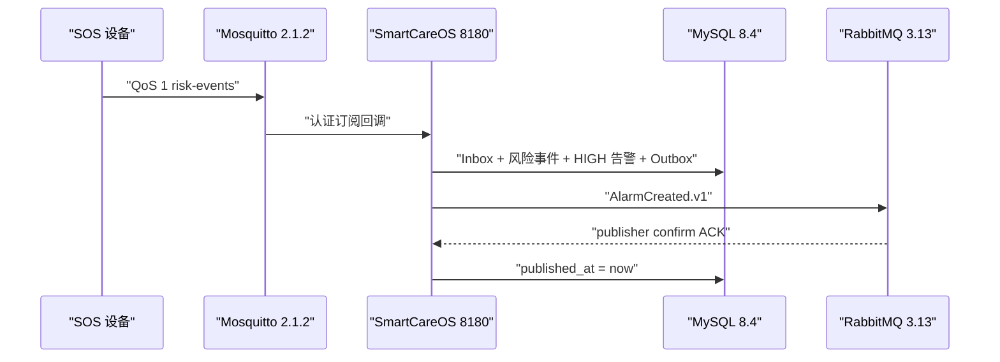

# SmartCareOS 外部消息链路联调报告

> 验证时间：2026-08-17 10:03–10:08 CST

## 结论

本地 Docker daemon 已恢复，SmartCareOS 使用隔离端口完成 MySQL、Mosquitto 与 RabbitMQ 真实联调。测试事件从 MQTT QoS 1 进入，经 Inbox 幂等、设备及老人有效绑定校验创建告警，再由事务 Outbox 在 RabbitMQ publisher confirm ACK 后标记完成。链路通过，服务保持运行。

## 运行态

| 组件 | 实际版本/端口 | 结果 |
|---|---|---|
| 默认 H2 应用 | PID `6501`，HTTP `8080`，管理 `9090` | `UP`，Schema `8` |
| 集成应用 | PID `6497`，HTTP `8180`，管理 `9190` | `UP` |
| MySQL | `8.4`，`127.0.0.1:13306` | healthy，Flyway `8` |
| RabbitMQ | `3.13-management`，`5673/15673` | healthy |
| Mosquitto | `2.1.2`，`18883` | healthy，匿名访问关闭 |

凭据通过环境变量注入，报告和交付包均不保存实际密码。

## 端到端证据

- 设备 `button-e2e-001` 已注册、激活并绑定老人；测试租户为 `integration-tenant`。
- MQTT 事件 `mqtt-e2e-20260817-001` 产生 1 条 `HIGH/NEW` 告警。
- 对应 `device_risk_event=1`、`alarm=1`、`outbox_event=1`。
- Outbox `published_at` 非空，`attempt_count=1`。
- RabbitMQ 队列收到 1 条 routing key 为 `AlarmCreated.v1` 的 JSON 信封，Exchange 为 `smartcare.events`。
- 完全相同的 MQTT 事件重放后，上述三个业务计数仍均为 1，验证 Inbox 幂等。
- 最终重启后的制品再次处理 `CRITICAL` 事件成功：风险事件、告警、已发布 Outbox 均为 1，RabbitMQ 联调队列累计 2 条消息。
- Prometheus 已输出 JVM 与 HTTP 请求指标。

## 自动化验证

全量 `clean package`：36 tests，0 failures，0 errors，0 skipped。新增 RabbitMQ 传输测试覆盖 ACK 信封和 NACK 失败路径；NACK 是本次检查的负向控制，确保 Broker 拒绝时不会误标 Outbox 已发布。

## 来源事实与架构推演

- 来源事实：《招聘信息汇总.md》明确提及 MQTT、MySQL、消息队列、智慧养老设备与告警场景。
- 架构推演：Mosquitto、RabbitMQ Topic Exchange、QoS 1 持久会话、事务 Inbox/Outbox、事件信封及本地隔离端口是工程选择，不代表原始材料指定产品或 SLA。

## 下一里程碑

本报告记录的是当时的 TCP/密码阶段。后续已完成 RabbitMQ DLQ 和 MQTT mTLS/设备 ACL，分别见 `MESSAGING-RESILIENCE-REPORT.md` 与 `MQTT-MTLS-REPORT.md`。OIDC/RBAC、压测、备份恢复和外部网关仍未在本报告中声称完成。
