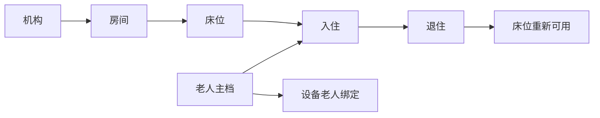

# 机构、老人与入住

## 来源事实

《招聘信息汇总.md》明确了系统面向养老机构、社区和政府部门，并包含机构管理后台。材料没有给出房间、床位、老人编号、入住状态机或退住接口契约。

## 架构推演

当前工程将空间主数据和老人业务分开：Institution 拥有机构、房间和床位；Elder 拥有老人主档和入住关系。入住只保存 Institution 提供的业务标识，不通过跨上下文数据库外键共享内部模型。

## 业务规则

- 机构编码在租户内唯一，房间编码在机构内唯一，床位编码在房间内唯一。
- 老人编号在租户内唯一。
- 入住时间段采用左闭右开 `[admittedAt, dischargedAt)`。
- 一段尚未退住的入住关系是开放区间，不能与该老人或该床位的任何历史区间重叠。
- 入住不接受未来时间；退住时间必须晚于入住时间且不得在未来。
- 入住和退住在同一事务内变更入住关系和床位占用状态。
- 并发变更固定先锁定老人、再锁定床位，使同人和同床的变更串行化。
- 居家养老老人不一定存在机构入住，因此设备绑定校验老人主档和租户，但不强制要求当前入住。

## 数据表

| 表 | 上下文 | 职责 |
|---|---|---|
| `institution` | Institution | 机构主数据 |
| `institution_room` | Institution | 机构房间 |
| `institution_bed` | Institution | 床位及当前占用状态 |
| `elder` | Elder | 老人主档 |
| `admission` | Elder | 老人与床位的有效期关系 |

## 待验证契约

- 多院区层级和楼栋、楼层是否需要独立实体；
- 换床是否必须作为一个原子业务动作；
- 预入住、请假、短期离院和床位保留的状态语义；
- 老人敏感字段、联系人、授权和数据保留周期。
