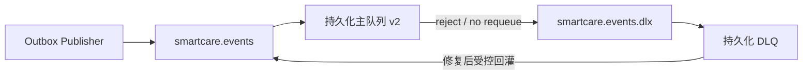

# SmartCareOS 消息韧性与故障演练报告

> 验证时间：2026-08-17 10:28–10:34 CST

## 结论

RabbitMQ 消息韧性里程碑已完成。联调拓扑使用持久化主队列、持久化 Dead Letter Exchange 和持久化 DLQ；真实完成拒绝死信、证据检查、回灌、Broker 重启以及重启后继续发布验证。

## 拓扑

| 资产 | 名称 | 持久化 |
|---|---|---|
| Topic Exchange | `smartcare.events` | 是 |
| 主队列 | `smartcare.events.integration.v2` | 是 |
| Dead Letter Exchange | `smartcare.events.dlx` | 是 |
| DLQ | `smartcare.events.integration.v2.dlq` | 是 |
| 死信 routing key | `smartcare.events.integration.v2.dead` | — |

## 真实验证证据

1. MQTT 事件 `mqtt-e2e-20260817-003` 生成告警并由 Outbox 首次发布成功，`attempt_count=1`。
2. 使用 `reject_requeue=false` 拒绝主队列消息，消息进入 DLQ。
3. DLQ 头部包含 `x-death.count=1`、`reason=rejected`、原 Exchange、主队列和 routing key；事件信封未丢失。
4. 先向 `smartcare.events` 回灌同一信封并得到 `routed=true`，再 ACK DLQ 原消息；最终主队列 `1`、DLQ `0`。
5. 仅重启隔离 RabbitMQ 容器，健康恢复后主队列和既有消息仍存在。
6. 重启后 MQTT 事件 `mqtt-e2e-20260817-004` 继续发布成功，Outbox `published_at` 非空、`attempt_count=1`；最终主队列 `2`、DLQ `0`。
7. H2 与 MySQL 集成实例 Actuator 均为 `UP`。

## 自动化验证

全量 `clean package`：37 tests，0 failures，0 errors，0 skipped。新增拓扑测试验证主队列/DLQ 持久化和死信参数；既有 RabbitMQ 传输测试继续覆盖 ACK 和 NACK。真实 `reject_requeue=false` 是本轮负向控制。

## 来源事实与架构推演

- 来源事实：《招聘信息汇总.md》明确提及消息队列、MQTT 和报警业务。
- 架构推演：RabbitMQ 产品选择、Exchange/队列名称、DLQ、至少一次传输和回灌顺序属于工程设计，不代表来源材料指定。

## 边界

本轮没有声称已经完成：业务消费者的最大重试次数、自动停车队列、跨区域 RabbitMQ 集群、容量压测、OIDC/RBAC、微信/短信或政务沙箱联调。MQTT mTLS 已在后续里程碑完成，见 `MQTT-MTLS-REPORT.md`。
