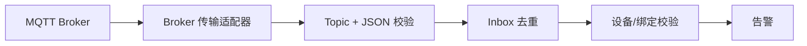

# MQTT 接入契约

## 来源事实

《招聘信息汇总.md》明确设备通过 MQTT 采集数据并触发告警。

## 架构推演

Topic: `smartcare/{tenantId}/devices/{deviceId}/risk-events`。Payload 包含 `eventId/tenantId/deviceId/elderId/severity/observedAt`。适配器先校验 Topic 与载荷身份一致，再复用 Inbox 幂等、设备状态/绑定校验和告警创建链路。

## 已落地的传输策略

- Eclipse Paho 异步客户端订阅 `smartcare/+/devices/+/risk-events`，QoS 为 1。
- `cleanSession=false`，启用自动重连；固定生产实例必须使用唯一且稳定的 Client ID。
- Broker 强制 TLS 1.3 双向证书认证，以客户端证书 CN 作为 ACL 身份，禁止匿名访问。
- 应用身份 `smartcareos-app` 仅可订阅风险 Topic；示例设备身份仅可写自己的精确 Topic。
- Paho 从 PKCS12 key store/trust store 加载客户端身份和信任链，并启用服务端主机名校验。
- 回调同步进入既有 Inbox/设备资格/告警事务链路；异常不会被伪装成成功。
- Actuator 总体健康包含 MQTT 连接状态。

2026-08-17 已在本地 Mosquitto 2.1.2 真实验证：TLS 1.3 mTLS 订阅成功；无证书握手被拒绝；应用只读证书越权发布返回 MQTT 5 `Not authorized`；设备证书发布产生 CRITICAL 告警并完成 Outbox/RabbitMQ；Broker 重启后 Paho 自动恢复 mTLS 会话。企业 PKI、证书吊销和批量设备证书生命周期仍待外部环境落地。
