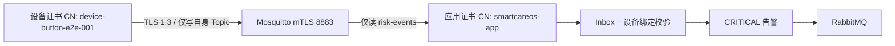

# SmartCareOS MQTT mTLS 与设备 ACL 验证报告

> 验证时间：2026-08-17 10:40–10:47 CST

## 结论

MQTT 安全传输里程碑已完成。Mosquitto 仅监听 TLS `8883` 并强制客户端证书；SmartCareOS 使用 PKCS12 客户端身份建立 TLS 1.3 持久会话；应用和设备证书身份由 ACL 分离。无证书和越权发布负向控制均生效，设备证书正向业务链路通过。

## 实现资产

- `scripts/generate-mosquitto-certs.sh`：生成隔离联调 CA、Broker、应用和示例设备证书，以及应用 PKCS12 key/trust store；默认拒绝覆盖已有证书。
- `deploy/mosquitto/mosquitto.conf`：`require_certificate=true`、`use_identity_as_username=true`、TLS `8883`。
- `deploy/mosquitto/acl`：应用身份只读风险 Topic；示例设备仅写自己的精确 Topic。
- Paho 订阅器：加载 PKCS12 key/trust store，启用服务端主机名校验、持久会话和自动重连。
- 生成的 `deploy/mosquitto/certs/` 被 `.gitignore` 排除，ZIP 不包含私钥、证书库或实际口令。

## 真实验证证据

1. Broker 健康检查使用应用客户端证书，TLS 1.3 密码套件为 `TLS_AES_256_GCM_SHA384`。
2. 不提供客户端证书时握手失败，Broker 记录 `peer did not return a certificate`。
3. 应用只读证书尝试写设备 Topic，MQTT 5 返回 `PUBACK RC:135 / Not authorized`，数据库未出现越权事件。
4. 设备证书 `device-button-e2e-001` 写授权 Topic，MQTT 5 `PUBACK RC:0`。
5. 事件 `mqtt-mtls-e2e-20260817-005` 产生 1 条 CRITICAL 告警；Outbox `published_at` 非空、`attempt_count=1`。
6. 重启 Mosquitto 后，Paho 记录 `reconnect=true`，重新协商 TLS 1.3；应用和 Broker 健康均为 `UP/healthy`。
7. 全量构建 37 tests，0 failures、0 errors、0 skipped。
8. 重复运行证书脚本默认退出 `1`，Broker 证书 SHA-256 前后保持一致，验证误轮换门禁。

## 来源事实与架构推演

- 来源事实：《招聘信息汇总.md》明确提及 MQTT 设备接入和告警，但没有指定 TLS、证书体系或 ACL 模型。
- 架构推演：Mosquitto、TLS 1.3、客户端证书 CN、PKCS12、Topic ACL 和本地 CA 均为工程设计选择。

## 边界

本地 CA 仅为可重复联调资产，不等于企业 PKI。生产仍需设备证书批量签发、吊销/CRL 或 OCSP、短周期轮换、硬件密钥保护、ACL 自动生成和证书库存审计。
