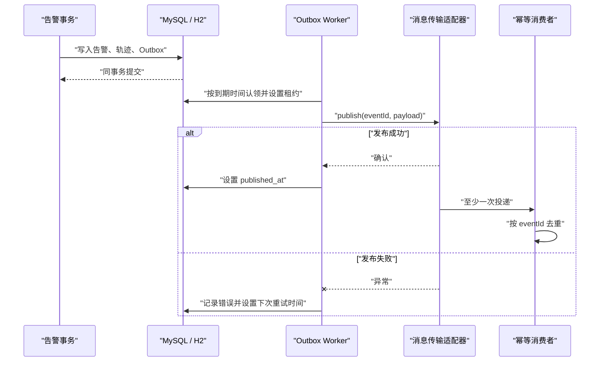

# Outbox 可靠发布

## 来源事实

《招聘信息汇总.md》提及消息队列、MySQL、MQTT 设备接入和报警业务，因此系统需要处理“业务数据提交后可靠通知其他模块”的问题。材料没有指定消息中间件产品、投递保证或重试算法。

## 架构推演

SmartCareOS 当前采用事务 Outbox 和至少一次投递。告警变化与事件记录在同一个数据库事务中完成；后台发布器使用短期租约认领到期事件，调用可替换的传输端口，成功后记录 `published_at`，失败后释放租约并指数退避。

## 一致性语义

- 数据库事务保证业务状态和待发布事件不会只成功一边。
- 发布保证是“至少一次”，不是“恰好一次”。
- 若进程在外部发送成功后、写入 `published_at` 前退出，租约过期后会再次发送。
- 每个实际消费者必须以 `eventId` 建立唯一消费记录或等价幂等约束。
- `last_error` 最多保存 1000 字符，不应写入口令、健康详情或完整外部响应。

## 运行状态

| 字段 | 含义 |
|---|---|
| `attempt_count` | 事件被成功认领的累计次数 |
| `next_attempt_at` | 失败后的最早重试时间 |
| `locked_by` / `locked_at` | 当前工作节点和租约起点 |
| `last_error` | 最近一次失败摘要 |
| `published_at` | 非空表示已由传输适配器确认 |

默认退避从 2 秒开始并按尝试次数翻倍，上限 15 分钟；默认租约 1 分钟。配置位于 `smartcareos.outbox.*`。发布任务默认关闭，只有同时满足以下条件才启动：

1. `smartcareos.outbox.enabled=true`；
2. Spring 容器中存在一个 `OutboxEventTransport` 实现。

`outbox-log` profile 仅提供开发日志实现。`rabbitmq` profile 提供真实 RabbitMQ 适配器：发布到持久化 Topic Exchange `smartcare.events`，routing key 为事件类型；只有收到 correlated publisher ACK 后才写入 `published_at`，NACK/超时均进入既有退避重试。

2026-08-17 已在 RabbitMQ 3.13 完成外部验证：`AlarmCreated.v1` 信封到达联调队列，消息头包含 `eventId/tenantId/eventType`，业务 Payload 保持 JSON 对象；MySQL 中对应 Outbox 为 `published_at` 非空且 `attempt_count=1`。

联调 profile 声明持久化主队列 `smartcare.events.integration.v2`、Dead Letter Exchange `smartcare.events.dlx` 和持久化 DLQ `smartcare.events.integration.v2.dlq`。真实拒绝后 `x-death.reason=rejected`，回灌后主队列恢复、DLQ 清空；RabbitMQ 容器重启后队列和消息保留。该队列仍是联调证据资产，正式消费者应以自己的服务边界声明队列、重试次数、DLQ 告警和幂等 Inbox。
