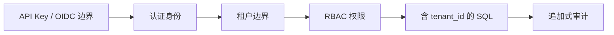

# M11 身份、角色与租户隔离

## 结论

V9 为 API 凭据增加 `ADMIN`、`OPERATOR`、`CAREGIVER`、`AUDITOR`、`DEVICE_INGEST` 五类角色。认证、URI 资源租户解析、请求体租户校验和角色授权均在 Controller 调用前执行；通知与政务交换的查询和更新同时携带 `tenant_id` 条件。

## 角色基线

| 角色 | 用途 |
|---|---|
| ADMIN | 租户管理与凭据轮换 |
| OPERATOR | 日常运营，不含政务报送与凭据管理 |
| CAREGIVER | 查询及护理/告警处置动作 |
| AUDITOR | 只读审计 |
| DEVICE_INGEST | 仅提交设备风险事件 |

## OIDC 边界

认证支持 `api-key` 与 `oidc` 两种模式。OIDC 模式通过 Issuer/JWKS 验证 Bearer JWT，并把 `sub`、`tenant_id` 和 `roles` 映射到统一身份上下文。自动化测试使用受控解码器验证映射和拒绝路径；没有真实身份提供商、Issuer/JWKS 和客户端登记，因此本文不声称完成真实身份提供商联调。

## 来源事实与架构推演

- 来源事实：招聘信息支撑机构管理、政务接口和多端协作场景。
- 架构推演：角色集合、权限矩阵、API Key/OIDC 统一身份边界和 SQL 租户约束为本工程安全设计。
